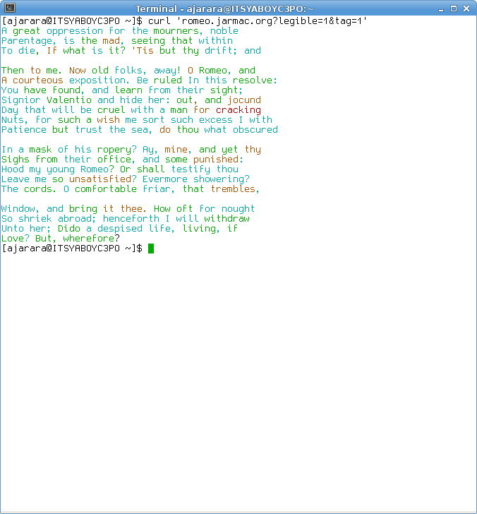

# Webkov

This application is built and deployed with Nix.


Once installed:
```
usage: shakespeare [-h] [--port 18293] [--addr 0.0.0.0]

optional arguments:
  -h, --help      show this help message and exit
  --port 18293    Port to run shakespeare on
  --addr 0.0.0.0  Interface to bind to. Defaults to all.
```

# Client usage:
Simply issue a get request querying for any character:

``` bash
$ curl friar-laurence.jarmac.org

There on this holy order, come: farewell;
Which bore my letters know the letter back
With twenty hundred thousand times more joy
Than we can find a drunkard reels from Mantua.
And steep'd in all, and to turn your will beshrew

Me assure thou slain Tybalt, I come forth,
For loving, what an lament, grace that madmen
Have violent delights have married to go to
Thy back; and cheeks for no notice of thy bed
To-night have. Not in a drunkard reels from

Mantua: Tybalt; and true use revolts from
Death: virtue itself turns vice sometimes
By doing damned hate upon thy nurse lie with
Streaks of our law calls death; but hollow
Perjury, Is Rosaline, is her, and could not
Well as desperate an execution. Too familiar

Is guilty of holy act, as from her come; and
Where the maid; but when presently through
All for Rosaline?
```

This is available for almost all characters in Romeo and Juliet. They have to end a sentence at least twice. 9 out of 24 characters do not do this :(

The less dialog a character has, the more... predictable they get:

``` bash
$ curl second-musician.jarmac.org
Hang him, and put up your dagger, we'll in here;
Tarry for silver. I say 'silver sound,' because
Musicians sound for the mourners, and put
Up your wit. I say 'silver sound,' because
Musicians sound for silver. Hang him, put

Up your dagger, Jack! Come, Jack! Come, we'll
In here; tarry for silver. Hang him, and stay
Dinner. I say 'silver sound,' because musicians
Sound for silver. I say 'silver sound,' because
Musicians sound for silver. I say 'silver
Sound,' because musicians sound for silver.

I say 'silver sound,' because musicians sound
For the mourners, and put up your wit. Hang
Him, put up your wit. Hang him, Jack! Come,
And stay dinner. Hang him, Jack! Come, Jack!
Come, we'll in here; tarry for silver. I say
'silver sound,' because musicians sound

For the mourners, and stay dinner. Hang him,
We'll in here; tarry for silver. Hang him,
And put out your wit.
```

# Client options:

Options are presented cgi-style:
lady-montague.jarmac.org?tokens=4000&order=2

These are case sensitive.
## tokens
The number of tokens generated internally. These are then truncated. You can always be guaranteed that you will recieve less than the amount you requested. Don't request more than 75000 tokens, that many are for pro members only.

## order
Before listening for requests, the code will pass through romeo and juliet's dialogue stream 5 times, generating order n markov chains, for 1 <= n < 5. An order N markov chain in this context generates a token by looking at the previous N tokens. The higher the order, the more output looks like genuine Shakespeare, but the less interesting the model becomes.

## legible
Legibility is an experiment I did regarding order. As you increase the order of the markov chain generating the token stream, you get closer and closer to Shakespeare. Increase the order too much, and you are outputting literal Shakespeare. Instead, what if tokens were generated with this policy: use the highest order possible while leaving the possibility of choice (where the last N tokens presented multiple options for a new token), so that all output had a chance of being generated.

Strangely enough, the output is less readable then static output. When trying to understand why, it's useful to set the next option:

## tag
This will wrap each token in a color corresponding to the order that generated it under the legible model. This uses [termcolor](https://github.com/hfeeki/termcolor), which expects output is a terminal accepting ANSI color codes. Here's an example:



The order-color map is:
``` python
ORDER_COLOR_MAP = {
    0: 'white',  # used for the very first token.
    1: 'cyan',
    2: 'green',
    3: 'yellow',
    4: 'red',
    5: 'magenta',
}
```
